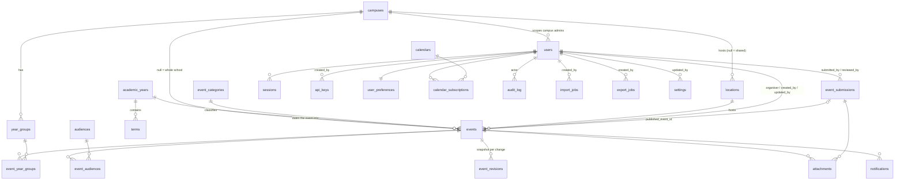

# PBIS Central Calendar — Data Model Reference

Version 1.0. This document describes the schema implemented in
`db/migrations/001_init.sql` (SQLite, source of truth), its port in
`db/postgres/001_init.sql`, and the way `src/db.js`, `src/repo.js`,
`src/lib/recurrence.js` and `src/lib/visibility.js` read and write it.
Everything below is taken from the code.

---

## 1. Conventions

### 1.1 Identifiers

Every primary key is `TEXT`. Application-generated ids come from `id(prefix)` in
`src/db.js`:

```js
function id(prefix) {
  const t = Date.now().toString(36);
  const r = crypto.randomBytes(6).toString('base64url');
  return `${prefix}_${t}${r}`;
}
```

The result is cuid-style: a prefix, a base-36 millisecond timestamp and eight
random base64url characters — e.g. `evt_m4k2p1xQ8vTz`. Two consequences the
schema depends on:

* The id exists **before** the insert, so a row can be referenced (audit entries,
  revisions, link tables) inside the same transaction that creates it.
* The time prefix makes ids roughly insertion-ordered when sorted as text, which
  is why `ORDER BY ... , e.id` is a stable tiebreaker in `listEvents`.

Prefixes in use: `evt_` (events), `rev_` (event revisions), `aud_` (audit log).
Other tables use ids minted by their route handlers with the same helper.

Not every id is generated. Taxonomy and `calendars` rows use hand-written,
human-readable ids (`ey`, `pr`, `se`, `y8`, `holiday`, `all`, `yg-y5`) because
they appear in URLs, feed paths and configuration. `repo.closureDates()` matches
on the literal category id `'holiday'` — renaming that row's id changes school
closure behaviour.

### 1.2 Slugs

`slugify()` lowercases, collapses every non-alphanumeric run to `-`, trims
leading/trailing hyphens and truncates at 72 characters, falling back to
`'item'`. `uniqueSlug(table, base, ignoreId)` then probes the table and appends
`-2`, `-3` … until the slug is free. Event slugs are built from the title plus a
`YYMM` suffix: `uniqueSlug('events', \`${title}-${date.slice(2,7).replace('-','')}\`)`
gives `year-6-parent-evening-2609`.

### 1.3 Dates and times: Asia/Vientiane wall time

Dates and times are stored as **school wall time**, never as instants:

| Column kind | Format | Example |
|---|---|---|
| date | `'YYYY-MM-DD'` | `2026-09-24` |
| time | `'HH:MM'` (24h) | `08:30` |

The canonical zone is `Asia/Vientiane` (UTC+7, no DST); `src/lib/time.js` holds
`TZ_OFFSET_MIN = 420`. `events.timezone` exists as a column but is written as the
constant `'Asia/Vientiane'` by `createEvent` and is not in the `EDITABLE` map, so
in practice every row carries the same value.

Conversion to UTC happens only at the integration boundary — `T.icsStamp()` for
ICS `DTSTART`/`DTEND`, `T.isoLocal()` for the `+07:00` ISO output of the API. The
database never holds a device time zone.

Dates stay `TEXT` in both dialects on purpose: the application compares
`'YYYY-MM-DD'` strings lexicographically (`start_date <= ?`, `BETWEEN`,
`ORDER BY start_date`), which is identical in SQLite and Postgres. The Postgres
file notes that a deployment must use a deterministic collation (`C` or
`und-x-icu`) on these columns to match SQLite's `BINARY` comparison exactly.

### 1.4 Timestamps

`created_at`, `updated_at`, `published_at`, `deleted_at`, `expires_at`,
`last_used_at`, `sent_at`, `committed_at` and friends are ISO-8601 **UTC**
instants produced by `now()` — `new Date().toISOString()`, e.g.
`2026-08-14T03:52:11.204Z`. They are audit metadata, not calendar data; do not
confuse them with the wall-time `start_date`/`start_time` pair.

### 1.5 Soft delete

Nothing is hard deleted. `deleted_at` is set instead, and every read filters on
`deleted_at IS NULL` (the taxonomy accessors do it inline; events get it from
`eventScopeSql`). `archiveEvent` sets `status = 'archived'` *and* `deleted_at`;
`restoreEvent` clears `deleted_at` and resets the status to `'draft'`.

Tables with `deleted_at`: `users`, `campuses`, `year_groups`, `academic_years`,
`terms`, `event_categories`, `audiences`, `locations`, `events`, `attachments`,
`event_submissions`. Tables without it use a different lifecycle column:
`sessions.revoked_at`, `api_keys.revoked_at`,
`calendar_subscriptions.revoked_at`. `audit_log`, `event_revisions`,
`notifications`, `import_jobs`, `export_jobs`, `calendars`, `settings` and
`user_preferences` have no delete marker at all — audit and revision rows are
append-only by design.

`ON DELETE CASCADE` appears on several foreign keys. Because rows are never
actually deleted, those clauses matter only for genuine hard deletes (e.g. the
`DELETE FROM sessions WHERE expires_at < ?` sweep in `src/auth.js`).

### 1.6 Booleans

SQLite has no boolean type; flags are `INTEGER NOT NULL DEFAULT 0/1` and the
application writes literal `0`/`1` (`input.important ? 1 : 0`) and reads with
`!!row.important`. The Postgres port declares the same columns as real
`BOOLEAN NOT NULL DEFAULT FALSE/TRUE`: `users.active`, `*.archived`,
`events.all_day`, `events.important`, `events.notify`, `calendars."public"`,
`user_preferences.onboarded`. Any code path writing `0`/`1` to these must send
`true`/`false` on Postgres.

### 1.7 JSON-in-TEXT columns

Structured values are stored as JSON text and parsed with the tolerant helper in
`src/db.js`:

```js
const json = {
  parse(v, fallback) { try { return v == null ? fallback : JSON.parse(v); } catch { return fallback; } },
  stringify(v) { return JSON.stringify(v == null ? null : v); }
};
```

A malformed value therefore degrades to the fallback rather than throwing.

| Column | Shape | Default |
|---|---|---|
| `events.recurrence` | object or `NULL` — see §4 | `NULL` |
| `events.links` | array of `{label, url}` | `'[]'` |
| `event_revisions.snapshot` | full hydrated event object | required |
| `audit_log.detail` | array of `{field, from, to}`, truncated to 2000 chars | `NULL` |
| `event_submissions.year_group_ids` / `audience_ids` | array of ids | `'[]'` |
| `user_preferences.category_ids` | array of category ids | `'[]'` |
| `notifications.audience_ids` / `year_group_ids` | array of ids | `'[]'` |
| `import_jobs.mapping` | object, column mapping | `'{}'` |
| `import_jobs.rows` | array of parsed/validated preview rows | `'[]'` |

These stay `TEXT` in Postgres rather than becoming `JSONB` so both engines
round-trip byte-identical strings.

### 1.8 NOT NULL text columns

`repo.js` distinguishes "cleared" from "null" when patching an event:

```js
const NON_NULL_TEXT = new Set(['title', 'description', 'date', 'visibility', 'status', 'source']);
```

An empty string in a patch clears an optional column to `NULL`, but for these six
it is stored as `''` — blanking a description must not violate
`description TEXT NOT NULL DEFAULT ''`.

---

## 2. Entity-relationship overview

Three campuses (Early Years, Primary, Secondary) share one event table. An event
belongs to at most one campus (`NULL` means whole-school), exactly one category,
and optionally a location, organiser and academic year. Year groups and audiences
are many-to-many through link tables. Public submissions live in a separate
staging table until approval mints a real event. Every published change writes a
revision snapshot, and every write writes an audit row.



Relationships not expressed as foreign keys:

* `calendars.scope_ref` points at a campus, year group or category id depending on
  `scope_type`, but is an untyped `TEXT` with no FK.
* `events.source_ref` holds the originating submission id (`source='submission'`),
  import row reference (`'import'`) or the source event id (`'rollover'`), again
  with no FK.
* `settings.key` / `value` is an untyped string store.

---

## 3. Tables

### 3.1 People and access

#### `users`

Every human account: staff, parents, students, and the built-in roles used for
authorisation. Password login and Google Workspace SSO share one row.

| Column | Type | Null | Default | Meaning |
|---|---|---|---|---|
| `id` | TEXT PK | no | — | Account id |
| `email` | TEXT | no | — | Unique login address |
| `name` | TEXT | no | — | Display name |
| `initials` | TEXT | no | — | Avatar initials |
| `role` | TEXT | no | — | One of `super`, `caladmin`, `campusadmin`, `teacher`, `parent`, `student`, `public` |
| `campus_id` | TEXT FK → `campuses.id` | yes | — | Set for campus admins; drives campus scoping in SQL (§5) |
| `password_hash` | TEXT | yes | — | `NULL` when the account is SSO-only |
| `external_id` | TEXT | yes | — | Google Workspace subject; unique |
| `active` | INTEGER (bool) | no | `1` | Deactivated accounts cannot sign in |
| `last_login_at` | TEXT | yes | — | ISO-8601 UTC |
| `created_at` / `updated_at` | TEXT | no | — | ISO-8601 UTC |
| `deleted_at` | TEXT | yes | — | Soft delete |

Constraints: `UNIQUE(email)`, `UNIQUE(external_id)`, `CHECK` on `role`.
Indexes: `idx_users_role(role)`, `idx_users_campus(campus_id)`.

Non-obvious: the `public` role is a real enum member, but it is normally a
synthetic viewer (`PUBLIC_VIEWER` in `src/auth.js`) rather than a stored row.
`users.campus_id` is a forward reference — in Postgres the FK is added by
`ALTER TABLE` after `campuses` is created, so column order matches SQLite
one-for-one.

#### `sessions`

Server-side session records. The id is opaque and travels in a signed cookie.

| Column | Type | Null | Default | Meaning |
|---|---|---|---|---|
| `id` | TEXT PK | no | — | Opaque session id |
| `user_id` | TEXT FK → `users.id` ON DELETE CASCADE | no | — | Owner |
| `created_at` | TEXT | no | — | ISO-8601 UTC |
| `expires_at` | TEXT | no | — | Absolute expiry, ISO-8601 UTC |
| `user_agent` | TEXT | yes | — | Captured at sign-in |
| `ip` | TEXT | yes | — | Captured at sign-in |
| `revoked_at` | TEXT | yes | — | Set on sign-out |

Indexes: `idx_sessions_user(user_id)`, `idx_sessions_expiry(expires_at)`.

Non-obvious: this is the one table that is genuinely hard-deleted from —
`src/auth.js` runs `DELETE FROM sessions WHERE expires_at < ?` as housekeeping.

#### `api_keys`

Integration credentials for signage screens, the school website and the future
app. Only the hash is stored; the raw key is shown once at creation.

| Column | Type | Null | Default | Meaning |
|---|---|---|---|---|
| `id` | TEXT PK | no | — | Key id |
| `name` | TEXT | no | — | Human label |
| `key_hash` | TEXT | no | — | Hash of the raw key; unique |
| `scopes` | TEXT | no | `'read'` | Comma-separated scope list |
| `created_by` | TEXT FK → `users.id` | yes | — | Issuing admin |
| `created_at` | TEXT | no | — | ISO-8601 UTC |
| `last_used_at` | TEXT | yes | — | Touched on each successful authentication |
| `revoked_at` | TEXT | yes | — | Revocation is a timestamp, not a delete |

Constraints: `UNIQUE(key_hash)`. No indexes beyond the PK and that unique.

Non-obvious: a valid Bearer key upgrades an anonymous caller to an effective
`teacher` viewer (`req.user = { ...PUBLIC_VIEWER, role: 'teacher', viaApiKey: true }`),
so integration feeds see `public` **and** `internal` events but never
`restricted` ones. `scopes` is a free-text list, not a checked enum.

### 3.2 Academic structure

#### `campuses`

The three PBIS campuses. The colour is used across the UI and ICS output.

| Column | Type | Null | Default | Meaning |
|---|---|---|---|---|
| `id` | TEXT PK | no | — | Short id (`ey`, `pr`, `se`) |
| `name` | TEXT | no | — | Full name |
| `short` | TEXT | no | — | Abbreviation (`EY`, `PRI`, `SEC`) |
| `slug` | TEXT | no | — | URL segment; unique |
| `blurb` | TEXT | yes | — | Descriptive line |
| `colour` | TEXT | no | `'#3D8062'` | Hex colour |
| `sort_order` | INTEGER | no | `0` | Display order |
| `archived` | INTEGER (bool) | no | `0` | Hidden from pickers but still resolvable |
| `created_at` / `updated_at` | TEXT | no | — | ISO-8601 UTC |
| `deleted_at` | TEXT | yes | — | Soft delete |

Constraints: `UNIQUE(slug)`. No secondary indexes.

Non-obvious: `archived` and `deleted_at` are different states. `taxonomy.campuses()`
filters on `deleted_at IS NULL` only, so archived rows are still returned and the
client decides whether to offer them.

#### `year_groups`

Year groups within a campus (Reception through Year 13).

| Column | Type | Null | Default | Meaning |
|---|---|---|---|---|
| `id` | TEXT PK | no | — | Short id (`rec`, `y8`) |
| `name` | TEXT | no | — | Display name |
| `slug` | TEXT | no | — | URL segment; unique |
| `campus_id` | TEXT FK → `campuses.id` | no | — | Owning campus (required) |
| `sort_order` | INTEGER | no | `0` | Display order |
| `archived` | INTEGER (bool) | no | `0` | Hidden from pickers |
| `created_at` / `updated_at` | TEXT | no | — | ISO-8601 UTC |
| `deleted_at` | TEXT | yes | — | Soft delete |

Constraints: `UNIQUE(slug)`. Index: `idx_yeargroups_campus(campus_id)`.

#### `academic_years`

The school year envelope. `repo.academicYearFor(dateKey)` stamps an event with the
year whose range contains its start date.

| Column | Type | Null | Default | Meaning |
|---|---|---|---|---|
| `id` | TEXT PK | no | — | e.g. `ay2627` |
| `name` | TEXT | no | — | e.g. `2026–2027`; unique |
| `start_date` / `end_date` | TEXT | no | — | Wall-time date keys, inclusive |
| `status` | TEXT | no | `'planning'` | `draft`, `planning`, `active`, `archived` |
| `created_at` / `updated_at` | TEXT | no | — | ISO-8601 UTC |
| `deleted_at` | TEXT | yes | — | Soft delete |

Constraints: `UNIQUE(name)`, `CHECK` on `status`.
Indexes: `idx_ay_status(status)`, `idx_ay_range(start_date, end_date)`.

Non-obvious: `taxonomy.activeYear()` assumes at most one row with
`status='active'`; the schema does not enforce that, and overlapping date ranges
would make `academicYearFor` non-deterministic (it takes the first match).

#### `terms`

Terms and half-terms inside an academic year. These are what the recurrence
engine consults for `termTime` series.

| Column | Type | Null | Default | Meaning |
|---|---|---|---|---|
| `id` | TEXT PK | no | — | Term id |
| `academic_year_id` | TEXT FK → `academic_years.id` ON DELETE CASCADE | no | — | Parent year |
| `name` | TEXT | no | — | e.g. `Autumn Term` |
| `start_date` / `end_date` | TEXT | no | — | Wall-time date keys, inclusive |
| `status` | TEXT | no | `'planned'` | `planned`, `active`, `complete` |
| `sort_order` | INTEGER | no | `0` | Display order within the year |
| `created_at` / `updated_at` | TEXT | no | — | ISO-8601 UTC |
| `deleted_at` | TEXT | yes | — | Soft delete |

Constraints: `CHECK` on `status`.
Indexes: `idx_terms_ay(academic_year_id)`, `idx_terms_range(start_date, end_date)`.

Non-obvious: `R.expand()` is passed **all** non-deleted terms
(`taxonomy.terms()`), across every academic year, not just the active one. A date
counts as in-term if it falls inside any of them.

### 3.3 Taxonomy

#### `event_categories`

Event classification and colour. Categories are referenced by a required FK from
`events`, so a category can be archived but not meaningfully removed.

| Column | Type | Null | Default | Meaning |
|---|---|---|---|---|
| `id` | TEXT PK | no | — | e.g. `academic`, `holiday`, `trip` |
| `name` | TEXT | no | — | Display name |
| `slug` | TEXT | no | — | URL segment; unique |
| `colour_var` | TEXT | no | — | CSS custom-property name for the category colour |
| `sort_order` | INTEGER | no | `0` | Display order |
| `archived` | INTEGER (bool) | no | `0` | Hidden from pickers |
| `created_at` / `updated_at` | TEXT | no | — | ISO-8601 UTC |
| `deleted_at` | TEXT | yes | — | Soft delete |

Constraints: `UNIQUE(slug)`.

Non-obvious: the id `'holiday'` is load-bearing. `repo.closureDates()` derives all
school closures from events in that category:

```sql
SELECT start_date, end_date FROM events
WHERE category_id = 'holiday' AND deleted_at IS NULL
  AND status NOT IN ('cancelled','draft','archived')
  AND start_date <= ? AND COALESCE(end_date, start_date) >= ?
```

Closures are therefore entered once, as events — there is no separate closure
table. The result is memoised in a single-entry cache keyed by `from|to` and
invalidated by `invalidateClosures()` after every event create, update or archive.
The per-row day expansion is bounded by a 400-iteration guard.

#### `audiences`

Who an event is aimed at: parents, students, teachers, staff, leadership,
community.

| Column | Type | Null | Default | Meaning |
|---|---|---|---|---|
| `id` | TEXT PK | no | — | e.g. `parents` |
| `name` | TEXT | no | — | Display name |
| `slug` | TEXT | no | — | URL segment; unique |
| `sort_order` | INTEGER | no | `0` | Display order |
| `created_at` / `updated_at` | TEXT | no | — | ISO-8601 UTC |
| `deleted_at` | TEXT | yes | — | Soft delete |

Constraints: `UNIQUE(slug)`. No `archived` column — audiences are the one taxonomy
without one.

Non-obvious: audience relationships are widened at read time, not in the
database. `visibility.AUDIENCE_ACCEPT` maps a viewer's audience onto the set it
should also see (a parent sees `parents`, `students`, `community`).

#### `locations`

Rooms, halls and off-site placeholders. Used for the double-booking checks.

| Column | Type | Null | Default | Meaning |
|---|---|---|---|---|
| `id` | TEXT PK | no | — | e.g. `loc-sehall` |
| `name` | TEXT | no | — | Display name |
| `slug` | TEXT | no | — | URL segment; unique |
| `campus_id` | TEXT FK → `campuses.id` | yes | — | `NULL` = shared across campuses |
| `capacity` | INTEGER | yes | — | Seats/places |
| `archived` | INTEGER (bool) | no | `0` | Hidden from pickers |
| `created_at` / `updated_at` | TEXT | no | — | ISO-8601 UTC |
| `deleted_at` | TEXT | yes | — | Soft delete |

Constraints: `UNIQUE(slug)`. Index: `idx_locations_campus(campus_id)`.

### 3.4 Events

#### `events`

The central table. One row is one calendar entry; recurring entries are a single
row expanded into occurrences at read time (§4), never materialised.

| Column | Type | Null | Default | Meaning |
|---|---|---|---|---|
| `id` | TEXT PK | no | — | `evt_…` |
| `slug` | TEXT | no | — | `title-YYMM`, unique |
| `title` | TEXT | no | — | Event title |
| `description` | TEXT | no | `''` | Long description; `''` not `NULL` when blank |
| `start_date` | TEXT | no | — | Wall-time date key; first day |
| `end_date` | TEXT | yes | — | Last day of a multi-day span, **inclusive** |
| `start_time` | TEXT | yes | — | `HH:MM`; `NULL` when `all_day` |
| `end_time` | TEXT | yes | — | `HH:MM`; `NULL` when `all_day` |
| `all_day` | INTEGER (bool) | no | `0` | Setting it to 1 nulls both times |
| `timezone` | TEXT | no | `'Asia/Vientiane'` | Always written as the default |
| `campus_id` | TEXT FK → `campuses.id` | yes | — | `NULL` = whole school |
| `category_id` | TEXT FK → `event_categories.id` | no | — | Required classification |
| `location_id` | TEXT FK → `locations.id` | yes | — | Venue |
| `organizer_id` | TEXT FK → `users.id` | yes | — | Defaults to the creating user |
| `academic_year_id` | TEXT FK → `academic_years.id` | yes | — | Derived from `start_date` on write |
| `visibility` | TEXT | no | `'public'` | `public`, `internal`, `restricted` |
| `status` | TEXT | no | `'draft'` | `draft`, `pending`, `published`, `cancelled`, `postponed`, `completed`, `archived` |
| `important` | INTEGER (bool) | no | `0` | Surfaces in the "Important Dates" feed |
| `notify` | INTEGER (bool) | no | `0` | Requests a notification when published |
| `recurrence` | TEXT (JSON) | yes | — | RFC 5545 subset; see §4 |
| `links` | TEXT (JSON) | no | `'[]'` | Array of `{label, url}` |
| `source` | TEXT | no | `'manual'` | `manual`, `import`, `submission`, `rollover` |
| `source_ref` | TEXT | yes | — | Submission id, import reference or source event id |
| `created_at` / `updated_at` | TEXT | no | — | ISO-8601 UTC |
| `published_at` | TEXT | yes | — | Set once, the first time status becomes `published` |
| `created_by` / `updated_by` | TEXT FK → `users.id` | yes | — | Actor ids |
| `deleted_at` | TEXT | yes | — | Soft delete |

Constraints: `UNIQUE(slug)`; `CHECK`s on `visibility`, `status`, `source`.

Indexes:

| Index | Columns | Purpose |
|---|---|---|
| `idx_events_range` | `(start_date, end_date)` | The hot path: every calendar view is a date-range query |
| `idx_events_status` | `(status)` | CMS filters |
| `idx_events_campus` | `(campus_id)` | Campus scoping |
| `idx_events_category` | `(category_id)` | Category filters and closure lookup |
| `idx_events_location` | `(location_id, start_date)` | Conflict detection |
| `idx_events_important` | `(important)` | Important-dates feed |
| `idx_events_ay` | `(academic_year_id)` | Year rollover |
| `idx_events_live` | `(status, visibility, start_date)` | Covers the visibility clause plus range |

Non-obvious behaviour:

* `end_date` is **inclusive**. `spanLen = diffDays(start, end) + 1`, and
  `COALESCE(end_date, start_date)` stands in for the end whenever it is null.
* `published_at` is written by `createEvent` only when the event is created
  already published, and by `updateEvent` only `if (patch.status === 'published' && !before.publishedAt)`.
  It is never cleared, so unpublishing leaves it set — and that is deliberate:
  `updateEvent` snapshots on `before.status === 'published' || before.publishedAt`,
  so an event that was ever published keeps getting revisions.
* `academic_year_id` is recomputed on every patch that touches `date`.
* The range query widens for recurring rows, because a series that started before
  the window may still occur inside it:

  ```sql
  (   (e.recurrence IS NULL AND e.start_date <= ? AND COALESCE(e.end_date, e.start_date) >= ?)
   OR (e.recurrence IS NOT NULL AND e.start_date <= ?) )
  ```

  There is no `until`-based pruning in SQL; expired series are discarded during
  expansion.
* Only the columns in `repo.EDITABLE` can be patched by field name
  (`title, description, date, endDate, start, end, campusId, categoryId,
  locationId, organizerId, visibility, status, source`). `allDay`, `important`,
  `notify`, `recurrence`, `links`, `academic_year_id` and `published_at` are
  handled by explicit branches; `slug`, `timezone` and `source_ref` are not
  editable at all after creation.

#### `event_year_groups`

Link table: an event can target several year groups.

| Column | Type | Null | Default | Meaning |
|---|---|---|---|---|
| `event_id` | TEXT FK → `events.id` ON DELETE CASCADE | no | — | Event |
| `year_group_id` | TEXT FK → `year_groups.id` ON DELETE CASCADE | no | — | Target year group |

Constraints: `PRIMARY KEY (event_id, year_group_id)`.
Index: `idx_eyg_yg(year_group_id)` for the reverse lookup.

Non-obvious: **no rows means "everyone"**. `applyFilters` keeps an event when it
has no year-group links at all:

```sql
(   NOT EXISTS (SELECT 1 FROM event_year_groups g WHERE g.event_id = e.id)
 OR EXISTS (SELECT 1 FROM event_year_groups g WHERE g.event_id = e.id
            AND g.year_group_id IN (?,?,…)) )
```

`setLinks()` replaces the whole set (delete-then-`INSERT OR IGNORE`), so a patch
that supplies `yearGroupIds` is a full replacement, not a merge.

#### `event_audiences`

Link table: an event can target several audiences. Same structure and same
"empty means everyone" rule as `event_year_groups`.

| Column | Type | Null | Default | Meaning |
|---|---|---|---|---|
| `event_id` | TEXT FK → `events.id` ON DELETE CASCADE | no | — | Event |
| `audience_id` | TEXT FK → `audiences.id` ON DELETE CASCADE | no | — | Target audience |

Constraints: `PRIMARY KEY (event_id, audience_id)`. Index: `idx_ea_aud(audience_id)`.

Both link tables are read in `SELECT_EVENT` via correlated subqueries returning
`group_concat`, then split on `,` in `hydrate()` — which is why ids must never
contain a comma.

#### `event_revisions`

Immutable history. See §6 for exactly when a row is written.

| Column | Type | Null | Default | Meaning |
|---|---|---|---|---|
| `id` | TEXT PK | no | — | `rev_…` |
| `event_id` | TEXT FK → `events.id` ON DELETE CASCADE | no | — | Subject |
| `version` | INTEGER | no | — | 1-based, per event |
| `snapshot` | TEXT (JSON) | no | — | The full event **as it was before** the change |
| `changed_by` | TEXT FK → `users.id` | yes | — | Actor |
| `change_note` | TEXT | yes | — | `opts.note` from the caller |
| `created_at` | TEXT | no | — | ISO-8601 UTC |

Constraints: `UNIQUE (event_id, version)`.
Index: `idx_revisions_event(event_id, version DESC)`.

#### `attachments`

Files attached to either an event or a submission.

| Column | Type | Null | Default | Meaning |
|---|---|---|---|---|
| `id` | TEXT PK | no | — | Attachment id |
| `event_id` | TEXT FK → `events.id` ON DELETE CASCADE | yes | — | Set for event attachments |
| `submission_id` | TEXT FK → `event_submissions.id` ON DELETE CASCADE | yes | — | Set for submission attachments |
| `filename` | TEXT | no | — | Original filename |
| `mime` | TEXT | no | — | Content type |
| `size_bytes` | INTEGER | no | — | Size |
| `storage_key` | TEXT | no | — | Path on disk (under `PBIS_DATA_DIR/uploads`) or S3 object key |
| `uploaded_by` | TEXT FK → `users.id` | yes | — | Actor |
| `created_at` | TEXT | no | — | ISO-8601 UTC |
| `deleted_at` | TEXT | yes | — | Soft delete |

Index: `idx_attach_event(event_id)` only — there is **no** index on
`submission_id`.

Non-obvious: both parent columns are nullable and nothing enforces that exactly
one is set. `storage_key` is deliberately opaque so the same schema works for
local disk and object storage. `submission_id` is a forward reference; the
Postgres port adds the FK by `ALTER TABLE` after `event_submissions` exists.

### 3.5 Workflow

#### `event_submissions`

Staging for events proposed by teachers before an approver turns them into real
events. A submission is not canonical, which is why its year groups and audiences
are JSON arrays rather than link-table rows.

| Column | Type | Null | Default | Meaning |
|---|---|---|---|---|
| `id` | TEXT PK | no | — | Submission id |
| `title` | TEXT | no | — | Proposed title |
| `description` | TEXT | no | `''` | Proposed description |
| `start_date` | TEXT | no | — | Wall-time date key |
| `end_date` | TEXT | yes | — | Inclusive span end |
| `start_time` / `end_time` | TEXT | yes | — | `HH:MM` |
| `all_day` | INTEGER (bool) | no | `0` | All-day flag |
| `campus_id` | TEXT FK → `campuses.id` | yes | — | Proposed campus |
| `category_id` | TEXT FK → `event_categories.id` | yes | — | Nullable here, unlike `events` |
| `location_id` | TEXT FK → `locations.id` | yes | — | Proposed venue |
| `year_group_ids` | TEXT (JSON array) | no | `'[]'` | Proposed year groups |
| `audience_ids` | TEXT (JSON array) | no | `'[]'` | Proposed audiences |
| `status` | TEXT | no | `'pending'` | `draft`, `pending`, `changes`, `approved`, `rejected` |
| `reviewer_note` | TEXT | yes | — | Feedback to the submitter |
| `submitted_by` | TEXT FK → `users.id` | no | — | Author (required) |
| `reviewed_by` | TEXT FK → `users.id` | yes | — | Approver |
| `published_event_id` | TEXT FK → `events.id` | yes | — | Set on approval |
| `created_at` / `updated_at` | TEXT | no | — | ISO-8601 UTC |
| `deleted_at` | TEXT | yes | — | Soft delete |

Constraints: `CHECK` on `status`.
Indexes: `idx_sub_status(status)`, `idx_sub_user(submitted_by)`.

Non-obvious: the submission status enum is a different set from the event status
enum — `changes` (changes requested) exists only here, and there is no `pending`
review state shared between the two. Approval, in `src/routes/admin.js`, runs
inside one transaction: it calls `repo.createEvent(..., { status: 'published',
source: 'submission', sourceRef: row.id })`, then sets the submission to
`approved` with `published_event_id` pointing at the new event. The link is
therefore recorded on both sides — `events.source_ref` and
`event_submissions.published_event_id`. Submissions carry no `recurrence` column;
a recurring event cannot be proposed through this route.

### 3.6 Distribution and integration

#### `calendars`

Named subscribable scopes — the things `/feeds/{scope}.ics` resolves against.

| Column | Type | Null | Default | Meaning |
|---|---|---|---|---|
| `id` | TEXT PK | no | — | Human-readable: `all`, `primary`, `yg-y5`, `important` |
| `name` | TEXT | no | — | Display name |
| `description` | TEXT | yes | — | Blurb |
| `scope_type` | TEXT | no | — | `all`, `campus`, `yeargroup`, `category`, `important`, `holidays`, `exams`, `personal` |
| `scope_ref` | TEXT | yes | — | Campus / year-group / category id when the scope type needs one |
| `public` | INTEGER (bool) | no | `1` | Listed by `GET /api/v1/calendars` |
| `created_at` / `updated_at` | TEXT | no | — | ISO-8601 UTC |

Constraints: `CHECK` on `scope_type`. No soft delete, no indexes beyond the PK.

Non-obvious: `scope_ref` has no foreign key and its meaning depends on
`scope_type`. The `personal` calendar row is created lazily by
`INSERT OR IGNORE` in `src/routes/me.js` the first time a user asks for a personal
feed. `GET /api/v1/calendars` orders by `rowid`, a SQLite-specific column with no
Postgres equivalent.

#### `calendar_subscriptions`

A user's subscription to a calendar, addressed by a revocable token.

| Column | Type | Null | Default | Meaning |
|---|---|---|---|---|
| `id` | TEXT PK | no | — | Subscription id |
| `calendar_id` | TEXT FK → `calendars.id` ON DELETE CASCADE | no | — | Subscribed calendar |
| `user_id` | TEXT FK → `users.id` ON DELETE CASCADE | yes | — | Owner; `NULL` for an anonymous feed |
| `token` | TEXT | no | — | Feed address secret; unique, revocable |
| `label` | TEXT | yes | — | User's own label |
| `created_at` | TEXT | no | — | ISO-8601 UTC |
| `last_fetched_at` | TEXT | yes | — | Touched on each feed fetch |
| `fetch_count` | INTEGER | no | `0` | Incremented on each fetch |
| `revoked_at` | TEXT | yes | — | Revocation timestamp |

Constraints: `UNIQUE(token)`. Index: `idx_subs_user(user_id)`.

Non-obvious: the token identifies the *viewer* as well as the calendar. When a
tokenised feed is fetched, `src/routes/feeds.js` joins through to the owning user
and builds the viewer from that row (`{ id, role, campus_id }`), so a personal
feed shows exactly what that user would see in the UI. An untokenised feed falls
back to `{ role: 'public' }`.

#### `user_preferences`

One row per user; the PK *is* the user id.

| Column | Type | Null | Default | Meaning |
|---|---|---|---|---|
| `user_id` | TEXT PK FK → `users.id` ON DELETE CASCADE | no | — | Owner |
| `campus_id` | TEXT FK → `campuses.id` | yes | — | Default campus filter |
| `year_group_id` | TEXT FK → `year_groups.id` | yes | — | Default year-group filter |
| `audience_id` | TEXT FK → `audiences.id` | yes | — | The viewer's own audience |
| `category_ids` | TEXT (JSON array) | no | `'[]'` | Selected categories |
| `theme` | TEXT | no | `'light'` | UI theme |
| `motion` | TEXT | no | `'on'` | Reduced-motion preference |
| `onboarded` | INTEGER (bool) | no | `0` | Onboarding completed |
| `updated_at` | TEXT | no | — | ISO-8601 UTC |

No `created_at`, no soft delete — the row is upserted.

#### `notifications`

Queued and sent announcements about an event.

| Column | Type | Null | Default | Meaning |
|---|---|---|---|---|
| `id` | TEXT PK | no | — | Notification id |
| `event_id` | TEXT FK → `events.id` ON DELETE CASCADE | yes | — | Subject event |
| `kind` | TEXT | no | — | `new`, `updated`, `cancelled`, `postponed`, `reminder` |
| `audience_ids` | TEXT (JSON array) | no | `'[]'` | Targeted audiences |
| `campus_id` | TEXT FK → `campuses.id` | yes | — | Targeted campus |
| `year_group_ids` | TEXT (JSON array) | no | `'[]'` | Targeted year groups |
| `subject` | TEXT | no | — | Message subject |
| `body` | TEXT | no | — | Message body |
| `status` | TEXT | no | `'queued'` | `queued`, `sent`, `failed`, `cancelled` |
| `recipients` | INTEGER | no | `0` | Resolved recipient count at queue time |
| `created_by` | TEXT FK → `users.id` | yes | — | Actor |
| `created_at` | TEXT | no | — | ISO-8601 UTC |
| `sent_at` | TEXT | yes | — | Dispatch time |

Constraints: `CHECK`s on `kind` and `status`. Index: `idx_notif_status(status)`.

Non-obvious: targeting is denormalised into JSON arrays rather than link tables —
a notification records the audience it was *sent to*, which must not change if the
event is later retargeted. `events.notify` is the request flag; a row here is the
record of the resulting queue entry.

#### `import_jobs`

A two-phase import: parse and preview, then commit.

| Column | Type | Null | Default | Meaning |
|---|---|---|---|---|
| `id` | TEXT PK | no | — | Job id |
| `filename` | TEXT | yes | — | Uploaded filename |
| `format` | TEXT | no | — | `csv`, `ics`, `xlsx` |
| `mapping` | TEXT (JSON) | no | `'{}'` | Source column → event field mapping |
| `rows` | TEXT (JSON) | no | `'[]'` | Parsed and validated preview rows |
| `row_count` | INTEGER | no | `0` | Rows parsed |
| `imported_count` | INTEGER | no | `0` | Rows actually written on commit |
| `status` | TEXT | no | `'preview'` | `preview`, `committed`, `cancelled`, `failed` |
| `created_by` | TEXT FK → `users.id` | yes | — | Actor |
| `created_at` | TEXT | no | — | ISO-8601 UTC |
| `committed_at` | TEXT | yes | — | Commit time |

Constraints: `CHECK`s on `format` and `status`. No indexes beyond the PK.

Non-obvious: the entire validated preview lives in the `rows` JSON blob, so a job
row can be large and is the sole state carried between the preview and commit
requests. `rows` is a reserved-ish word and is quoted in the Postgres port.

#### `export_jobs`

A minimal record that an export happened.

| Column | Type | Null | Default | Meaning |
|---|---|---|---|---|
| `id` | TEXT PK | no | — | Job id |
| `scope` | TEXT | no | — | What was exported |
| `format` | TEXT | no | — | `ics`, `csv` |
| `event_count` | INTEGER | no | `0` | Events written |
| `created_by` | TEXT FK → `users.id` | yes | — | Actor |
| `created_at` | TEXT | no | — | ISO-8601 UTC |

Constraints: `CHECK` on `format`. No `status` and no completion timestamp — the
row is written after the export is produced.

### 3.7 System

#### `audit_log`

Append-only record of who did what. See §6.

| Column | Type | Null | Default | Meaning |
|---|---|---|---|---|
| `id` | TEXT PK | no | — | `aud_…` |
| `action` | TEXT | no | — | Free text; in practice `created`, `updated`, `published`, `cancelled`, `postponed`, `moved`, `imported`, `approved`, `rejected`, `changes requested`, `archived`, `restored`, `signed_in`, `signed_out` |
| `entity` | TEXT | no | — | `event`, `submission`, `campus`, `user`, `settings`, … |
| `entity_id` | TEXT | yes | — | Subject id; `NULL` for entity-wide actions |
| `title` | TEXT | yes | — | Human label captured at the time |
| `detail` | TEXT (JSON) | yes | — | Diff summary, ≤ 2000 chars |
| `user_id` | TEXT FK → `users.id` | yes | — | Actor; `NULL` for system actions |
| `ip` | TEXT | yes | — | Caller IP |
| `created_at` | TEXT | no | — | ISO-8601 UTC |

Indexes: `idx_audit_time(created_at DESC)`, `idx_audit_entity(entity, entity_id)`,
`idx_audit_user(user_id)`.

Non-obvious: `action` and `entity` are **not** constrained by `CHECK`, unlike most
other enumerated columns — the comment in the migration lists the intended values
but nothing enforces them. `title` is denormalised on purpose so the log stays
readable after the subject is renamed or archived.

#### `settings`

Untyped key/value store for site configuration.

| Column | Type | Null | Default | Meaning |
|---|---|---|---|---|
| `key` | TEXT PK | no | — | Dotted key, e.g. `feeds.ttlMinutes` |
| `value` | TEXT | no | — | Always a string, including booleans (`'true'`) and numbers (`'15'`) |
| `updated_at` | TEXT | no | — | ISO-8601 UTC |
| `updated_by` | TEXT FK → `users.id` | yes | — | Actor |

Seeded keys include `site.domain`, `site.origin`, `school.name`, `product.name`,
`product.strapline`, `calendar.timezone`, `calendar.weekStart`,
`workflow.requireApproval`, `workflow.campusAdminMayPublish`,
`workflow.warnOnConflict`, `feeds.ttlMinutes`, `anniversary.enabled`.

Non-obvious: values are strings in both engines; callers must coerce.
`calendar.timezone` is a display setting and does not change how dates are
stored — the storage zone is fixed in `src/lib/time.js`.

#### `schema_migrations`

Created by the migration runner, not by any `.sql` file. See §7.

| Column | Type | Null | Default | Meaning |
|---|---|---|---|---|
| `version` | TEXT PK | no | — | Migration filename without `.sql` (e.g. `001_init`) |
| `applied_at` | TEXT | no | — | ISO-8601 UTC |

---

## 4. The `events.recurrence` JSON shape

`recurrence` is `NULL` for a one-off event (including a multi-day span, which is
expressed with `end_date`, not recurrence). When present it is a JSON object — an
RFC 5545 subset, expanded by `R.expand()` in `src/lib/recurrence.js` and
serialised to a real `RRULE` by `R.toRRule()`.

```json
{ "freq": "weekly", "interval": 2, "byday": [5], "until": "2026-12-11", "termTime": true }
```

### 4.1 Fields

| Field | Type | Required | Meaning |
|---|---|---|---|
| `freq` | `"daily"` \| `"weekly"` \| `"monthly"` \| `"yearly"` | yes | Base frequency. A missing or unrecognised `freq` degrades to a single occurrence on `start_date`. |
| `interval` | integer ≥ 1 | no (default 1) | Every *n*th day/week/month/year. Coerced with `Math.max(1, r.interval || 1)`. |
| `byday` | array of integers 0–6 | weekly/nth-monthly | Weekday numbers, **Sunday = 0** through Saturday = 6 (`DAY_CODE = ['SU','MO','TU','WE','TH','FR','SA']`). For weekly series, omitting it defaults to the weekday of `start_date`. |
| `bysetpos` | integer 1–5, or −1 | no | With `freq: "monthly"` and `byday`, selects the nth weekday of the month; −1 means last. |
| `until` | date key `'YYYY-MM-DD'` | no | Inclusive last date of the series. |
| `count` | integer | no | Serialised into the `RRULE` as `COUNT` and parsed back from it, but **not honoured by `expand()`** — the expander bounds a series by `until` and the query window only. |
| `termTime` | boolean | no | Restrict occurrences to school days (§4.3). |

Anything else in the object is ignored by the expander.

### 4.2 Examples

Weekly Monday assembly, term time only:

```json
{ "freq": "weekly", "interval": 1, "byday": [1], "until": "2026-12-11", "termTime": true }
```

Fortnightly Friday (every other week, not restricted to term time):

```json
{ "freq": "weekly", "interval": 2, "byday": [5], "until": "2026-12-11" }
```

First Friday of every month during term:

```json
{ "freq": "monthly", "interval": 1, "byday": [5], "bysetpos": 1, "until": "2027-06-04", "termTime": true }
```

Last Wednesday of every month:

```json
{ "freq": "monthly", "byday": [3], "bysetpos": -1 }
```

Monthly on the same day of the month (no `bysetpos`), daily during term, and
annual:

```json
{ "freq": "monthly", "interval": 1 }
{ "freq": "daily", "interval": 1, "termTime": true }
{ "freq": "yearly", "interval": 1 }
```

### 4.3 `termTime`

`termTime: true` filters occurrences through `isSchoolDay(d)`:

```js
const isSchoolDay = d => {
  if (terms && terms.length && !terms.some(t => d >= t.start_date && d <= t.end_date)) return false;
  if (closures && closures.has(d)) return false;
  const wd = T.dow(d);
  if (wd === 0 || wd === 6) return false;
  return true;
};
```

A date must be inside some term, not in the closure set (§3.3, derived from
`category_id = 'holiday'` events), and not a Saturday or Sunday. Half terms,
public holidays and training days sit inside term dates but are not school days,
so a weekly assembly skips them. The `yearly` branch never applies this filter.

### 4.4 Expansion semantics

* `spanLen` comes from `end_date`, so each occurrence of a recurring multi-day
  event emits `spanLen` rows: `{date, isStart, isEnd, spanIndex, spanLen}`. Only
  the days falling inside the requested window are returned.
* `until` is clamped to the window end: `const until = r.until && r.until < to ? r.until : to;`.
* Weekly series are phase-aligned to the week containing `start_date` so an
  `interval > 1` series lands on the right weeks even when the window starts
  mid-series. Weeks are Monday-start (`T.startOfWeek`, and the offset conversion
  `dw === 0 ? 6 : dw - 1`).
* Every loop carries an iteration guard — 600 weekly, 2000 daily, 400 monthly,
  60 yearly — so a malformed rule cannot produce an unbounded expansion.
* Occurrences are never stored. `listInRange` expands on read and sorts by date,
  then all-day first, then start time, then title.

### 4.5 Round-tripping

`toRRule()` emits `FREQ`, and conditionally `INTERVAL` (only when > 1), `BYDAY`
(mapped through `DAY_CODE`), `BYSETPOS`, `UNTIL` (as an ICS UTC stamp at 23:59
school time) and `COUNT`. `termTime` has **no RFC 5545 representation** and is
silently dropped, so an exported ICS series includes occurrences the platform
itself would skip. `fromRRule()` parses the same fields back for ICS import,
stripping any `+1`/`-1` prefix from `BYDAY` codes.

---

## 5. Visibility and campus scoping in SQL

Authorisation is decided in one place, `src/lib/visibility.js`, so the API, the
ICS feeds, the embed and the server-rendered event pages cannot diverge. Two role
tables drive it:

```js
function visibleStatuses(role) {
  if (role === 'super' || role === 'caladmin') return null;               // all
  if (role === 'campusadmin') return ['draft','pending','published','cancelled','postponed','completed'];
  return ['published','cancelled','postponed','completed'];
}

function visibleLevels(role) {
  if (['super','caladmin','campusadmin'].includes(role)) return ['public','internal','restricted'];
  if (['teacher','student','parent'].includes(role)) return ['public','internal'];
  return ['public'];
}
```

Note that `campusadmin` sees every status except `archived`, and that `archived`
events are visible only to `super` and `caladmin` — and then only if
`deleted_at` has not been set, which `archiveEvent` always does.

These become a composable SQL fragment:

```js
function eventScopeSql(viewer, alias = 'e') {
  const role = (viewer && viewer.role) || 'public';
  const clauses = [`${alias}.deleted_at IS NULL`];
  const params = [];

  const levels = visibleLevels(role);
  clauses.push(`${alias}.visibility IN (${levels.map(() => '?').join(',')})`);
  params.push(...levels);

  const statuses = visibleStatuses(role);
  if (statuses) {
    clauses.push(`${alias}.status IN (${statuses.map(() => '?').join(',')})`);
    params.push(...statuses);
  }

  // A campus admin sees their own campus plus whole-school events.
  if (role === 'campusadmin' && viewer.campus_id) {
    clauses.push(`(${alias}.campus_id = ? OR ${alias}.campus_id IS NULL)`);
    params.push(viewer.campus_id);
  }
  return { sql: clauses.join(' AND '), params };
}
```

Points that matter:

* The clause always includes `deleted_at IS NULL`, so soft delete and
  authorisation are enforced by the same fragment. Missing the fragment misses
  both.
* An absent or roleless viewer degrades to `public` — the safest option, not an
  error.
* `super` and `caladmin` get no status clause at all (`visibleStatuses` returns
  `null`), which is what lets them see `archived` rows.
* Campus scoping is additive, not exclusive: a campus admin sees their campus
  **plus** `campus_id IS NULL` whole-school events. The clause is skipped
  entirely if the admin has no `campus_id`, which means an unscoped campus admin
  sees every campus.
* Ordinary viewers (`teacher`, `student`, `parent`, `public`) get **no** campus
  clause. Campus filtering for them is a user-chosen filter in `applyFilters`, not
  an authorisation boundary — and that filter is also additive
  (`e.campus_id IS NULL OR e.campus_id IN (…)`), so whole-school events survive
  any campus filter.
* A Bearer API key raises an anonymous caller to an effective `teacher`, so
  integration feeds see `public` and `internal` but never `restricted`.

Every event read in `src/repo.js` starts from this fragment — `listInRange`,
`listEvents` (both the count and the page query) and `getEvent`. The one exception
is documented in the code:

```js
/** Raw fetch that ignores visibility — only for internal writes after an
    explicit permission check. */
function getEventRaw(idOrSlug) { … }
```

`getEventRaw` is used by `createEvent`, `updateEvent`, `archiveEvent` and
`restoreEvent` to read back what they just wrote; it must never reach a response
without a prior `can(...)` or `canEditEvent(...)` check.

Row-level write permission is a separate function:

```js
function canEditEvent(viewer, event) {
  if (!viewer || !can(viewer.role, 'edit')) return false;
  if (viewer.role === 'campusadmin') {
    if (event.campus_id && event.campus_id !== viewer.campus_id) return false;
    if (!event.campus_id) return false;   // whole-school events belong to calendar admins
  }
  return true;
}
```

Note the asymmetry with reads: a campus admin can *see* whole-school events but
cannot *edit* them.

---

## 6. Revisions and audit

Two independent trails. Revisions capture content; the audit log captures actions.

### 6.1 When a revision is written

`updateEvent` writes exactly one `event_revisions` row, at the top of the
transaction, **before** applying the patch, and only when:

```js
if (before.status === 'published' || before.publishedAt) { … }
```

That is: the event is currently published, or was published at some point in the
past (`published_at` is never cleared). Drafts that have never been published are
edited without any revision history.

The version is allocated inside the same transaction:

```js
const v = (db.prepare('SELECT COALESCE(MAX(version),0) v FROM event_revisions WHERE event_id=?')
  .get(eventId).v) + 1;
```

`UNIQUE (event_id, version)` is the backstop; `tx()` in `src/db.js` wraps the whole
update (and joins an outer transaction if one is already open), so the read-max /
insert pair cannot interleave.

Consequences worth stating plainly:

* Version *n* holds the state **before** change *n*. The current state is the
  `events` row itself; there is no revision row for it.
* `archiveEvent` calls `updateEvent(..., { status: 'archived' })`, so archiving a
  published event writes a revision of the pre-archive state, then sets
  `deleted_at` in a separate statement.
* `restoreEvent` updates the row directly and does **not** write a revision — it
  only writes an audit entry.
* `createEvent` writes no revision.

### 6.2 What a snapshot contains

`JSON.stringify(before)`, where `before` is the output of `getEventRaw` and
therefore of `hydrate()`: the full camelCase event object — `id`, `slug`, `title`,
`description`, `date`, `endDate`, `start`, `end`, `allDay`, `timezone`,
`campusId`, `categoryId`, `locationId`, `organizerId`, `academicYearId`,
`yearGroupIds`, `audienceIds`, `visibility`, `status`, `important`, `notify`,
`recurrence` (parsed object), `links` (parsed array), `attachments` (resolved
list with URLs), `source`, `createdAt`, `updatedAt`, `publishedAt`, `createdBy`,
`updatedBy`.

It is a hydrated API-shaped object, not a raw row: `deleted_at`, `source_ref`,
`created_by`'s name and the raw snake_case column names are not in it, and
`attachments` is a point-in-time resolution of the attachment table, not a
reference.

Reading it back: `revisions(eventId)` lists `id, version, changed_by,
change_note, created_at` (no snapshot payload) ordered by version descending;
`revision(eventId, version)` returns the row with `snapshot` parsed.

### 6.3 When an audit row is written

`repo.audit(action, entity, entityId, title, user, detail)` inserts one row per
call. Inside `repo.js` it fires on:

| Call site | action | entity | detail |
|---|---|---|---|
| `createEvent` | `created` | `event` | none |
| `updateEvent` | `opts.action` or `updated` | `event` | `diffSummary(before, patch)` |
| `archiveEvent` (via `updateEvent`) | `archived` | `event` | diff |
| `restoreEvent` | `restored` | `event` | none |

Route handlers call it directly for other entities — `approved`, `rejected` and
`changes requested` on `submission`, `updated` on `settings`, and so on. Sign-in
and sign-out are logged by `src/auth.js`.

`detail` is produced by `diffSummary`, which compares each patched key against the
hydrated `before` by JSON equality, skips `yearGroupIds` and `audienceIds`
entirely, and emits `[{field, from, to}]` truncated to 2000 characters — or `NULL`
when nothing changed. So link-table changes are *not* reflected in the audit
detail, though they are captured in the revision snapshot.

`auditList()` left-joins `users` to decorate each entry with `user_name` and
`user_role`, supports filtering by entity, entity id and a lowercase `LIKE` search
over title/action/user name, and caps the page at 500 rows.

---

## 7. Migrations

### 7.1 The runner

`migrate()` in `src/db.js` is the whole mechanism:

```js
function migrate() {
  db.exec(`CREATE TABLE IF NOT EXISTS schema_migrations (
             version TEXT PRIMARY KEY, applied_at TEXT NOT NULL)`);
  const applied = new Set(
    db.prepare('SELECT version FROM schema_migrations').all().map(r => r.version)
  );
  const dir = path.join(ROOT, 'db', 'migrations');
  const files = fs.readdirSync(dir).filter(f => f.endsWith('.sql')).sort();
  …
}
```

Behaviour:

1. `schema_migrations` is created by the runner, not by any `.sql` file — which is
   why neither `001_init.sql` defines it.
2. Every `.sql` file in `db/migrations` is considered, in **lexicographic filename
   order**. Hence the zero-padded `001_` prefix: `10_x.sql` would sort before
   `2_x.sql`.
3. The version is the filename minus `.sql` (`001_init`).
4. Already-applied versions are skipped.
5. Each file runs inside its own explicit `BEGIN` / `COMMIT`, with the
   `schema_migrations` insert in the same transaction. Any error triggers
   `ROLLBACK` and rethrows as `Migration ${version} failed: …`, so a partial
   migration is never recorded. (SQLite's DDL is transactional, so this genuinely
   rolls back.)
6. `migrate()` returns the list of versions it applied.

Migrations are forward-only: there is no `down` file, no checksum verification of
already-applied files, and no locking, so two processes starting simultaneously
against a fresh database both race on the same `BEGIN` — in practice the
`busy_timeout = 5000` pragma and the unique `version` PK make the loser fail
loudly rather than double-apply.

Connection setup, applied before any migration: `journal_mode = WAL`,
`foreign_keys = ON`, `busy_timeout = 5000`. The database file is
`PBIS_DB`, defaulting to `PBIS_DATA_DIR/pbis.db`, defaulting to `./data/pbis.db`;
`data/` and `data/uploads/` are created at load time.

### 7.2 `schema_migrations`

Two columns: `version TEXT PRIMARY KEY` and `applied_at TEXT NOT NULL`
(ISO-8601 UTC). The insert is `INSERT OR REPLACE`, so re-recording an existing
version updates its timestamp rather than failing. `GET /health` reports the
applied-migration count.

### 7.3 The two-file rule

`db/migrations/001_init.sql` (SQLite) is the source of truth. `db/postgres/001_init.sql`
is its port, and the two files describe **one** schema:

> any change to the SQLite migration has to be mirrored here in the same commit,
> and vice versa. Table names, column names, column order, CHECK constraints,
> foreign keys, unique constraints and index names are deliberately identical.

Only the runner in `src/db.js` applies the SQLite file; the Postgres file is
applied by whatever tooling the hosted deployment uses. Nothing in the codebase
checks that the two are in step, so the discipline is entirely a review
obligation.

The permitted differences, and only these:

| SQLite | Postgres | Why |
|---|---|---|
| `PRAGMA foreign_keys = ON;` | omitted | FKs are always enforced in Postgres |
| `users.campus_id`, `attachments.submission_id` inline `REFERENCES` | column declared bare, FK added by `ALTER TABLE` right after the target table is created | Forward references; keeps table and column order identical |
| `INTEGER NOT NULL DEFAULT 0/1` flags | `BOOLEAN NOT NULL DEFAULT FALSE/TRUE` | Real booleans where the dialect has them |
| `public`, `rows` | `"public"`, `"rows"` | Quoted only to keep names byte-identical; they are lowercase, so unquoted references resolve to the same columns |

Everything else — including keeping dates as `TEXT` and JSON payloads as `TEXT`
rather than `DATE` and `JSONB` — is identical by design, so both engines return
the same values and the same ordering. Two standing caveats recorded in the
Postgres file:

* Text date ordering is collation-dependent in Postgres; deployments must use a
  deterministic collation (`C` or `und-x-icu`) on these columns to match SQLite's
  `BINARY` comparison.
* Application code that writes literal `0`/`1` to the boolean columns must send
  `true`/`false` on Postgres. `src/repo.js` currently writes `0`/`1`.

The Postgres file also lists partial indexes worth adding if read volume warrants
them (`events` filtered on `deleted_at IS NULL AND status='published'`, `events`
filtered on `important`, `sessions` filtered on `revoked_at IS NULL`). They are
deliberately **not** created there, so the two schemas stay index-for-index
identical; adding them means a new migration applied to both engines.
